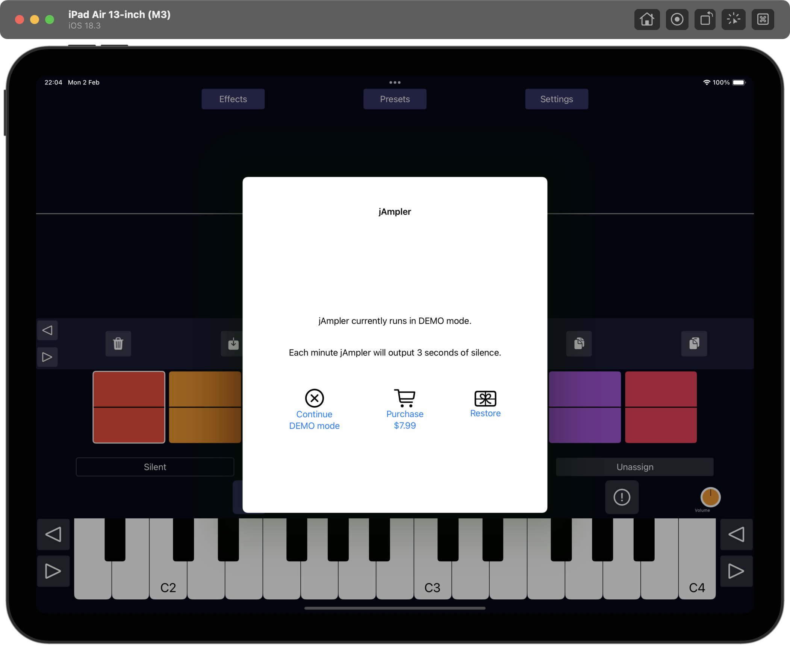

# jAmpler AUv3 Plugin

jAmpler is a sample-based instrument plugin for iOS and macOS, designed as an Audio Unit v3 (AUv3) instrument. It enables you to record, import, assign, and manipulate samples with a rich set of controls and global effects — all accessible in a compact, intuitive interface.

---

## Features

- **4 banks**, each with **8 samples**.
- Each sample is represented by a **unique color**.
- Record samples directly using your device’s **built-in microphone**.
- Import audio files to use as samples.
- Assign samples to keyboard keys using their **color codes**.
- Detailed controls per sample:
  - Copy, paste, and trim samples.
  - ADSR envelope (Attack, Decay, Sustain, Release).
  - Crossfade and crossfade overlap for seamless looping.
  - Octave shifting and drive/distortion.
  - Filter and pitch shift options.
  - Granular synthesis controls (wet, density, size, spray, stereo spread, window shape).
- Global effects:
  - Velocity Controlled Filter (VCF).
  - Low Frequency Oscillator (LFO).
  - Compressor.
  - Distortion.
  - Equalizer.
  - Chorus.
  - Cabinet.
  - Reverb.  
- Adjustable velocity curve and keyboard temperament.

---

## System Requirements

jAmpler is an AUv3 (Audio Unit version 3) plugin that can be used as a stand-alone application on iOS and macOS, or as an audio plugin inside a host application on iOS and macOS. 

Minimal requirements are:
  - iOS 14.0 or later for mobile (iPhone or iPad)
  - macOS 11.0 or later for desktop / laptop

jAmpler is distributed via the Apple App store. Click on the App store badge to go to the download location.

---

## Purchase Info

Installation of jAmpler is free, but it will run in DEMO mode. This means that every minute jAmpler will output 3 seconds of silence. This allows the user to test the audio plugin in depth before purchasing it.

Purchasing jAmpler is a straightforward and user-friendly process, following the standard steps from the Apple App Store you're likely familiar with. Once the plugin is unlocked, the DEMO mode will be gone, and you can enjoy the full potential.

To start the payment process you have to run jAmpler in stand-alone mode. A popup as in the image above should appear. Simply tap or click on "Purchase" and the Apple App Store will guide you through the process.

Note that you should only pay once to unlock the plugin. In case you have a new device, you can get the plugin unlocked by clicking on "Restore". If you go a second time through the payment system, no worries, Apple will notice this and give you the plugin for free.

Note that it is not possible to purchase the audio plugin via a third-party host application. If you run jAmpler via for instance GarageBand you will get a message as in the image above. Just start the stand-alone jAmpler application if you want to purchase.

---

## Getting Started

### Banks and Samples

- There are **four banks**, each containing **eight samples**.
- Samples are activated by pressing the corresponding **colored button**.
- Long-press an **empty sample button** to **record a new sample** using the microphone.
- Long-press a **non-empty sample button** to play the sample (if **Silent** mode is off).
- Each sample button’s color helps you identify and assign samples easily.

### Recording and Importing Samples

- To record a sample:  
  Long-press an empty sample button and speak or play into your device’s microphone.
- To import a sample:  
  Use the **Import Wave** function to load audio files as samples.

### Assigning Samples to Keyboard Keys

- Use the keyboard to trigger notes or to assign/unassign samples in `(Un)Assign` mode.
- Samples are assigned based on their **color codes**.
- Unassigned keys (gray) will trigger the closest assigned sample.
- Darker colors represent samples from other banks.

---

## Sample Controls

Each sample has the following controls and functions:

| Control                | Description                                                     |
|------------------------|-----------------------------------------------------------------|
| Copy / Paste           | Copy or paste sample waves and their controls.                 |
| Trim                   | Edit the start and end points of the sample wave.              |
| Assign                 | Assign the sample to keyboard keys using color codes.          |
| Attack / Decay / Sustain / Release (ADSR) | Shape the amplitude envelope of the sample.                   |
| Crossfade              | Enable seamless looping of the sample.                          |
| Crossfade Overlap      | Adjust overlap length for crossfade loops.                     |
| Octave                 | Shift the sample pitch by octaves.                             |
| Drive                  | Add distortion drive to the sample.                            |
| Filter                 | Apply a second-order biquad filter to the sample.              |
| Pitch Shift (or not)   | Enable or disable pitch shifting of the sample.                |
| Granular Wet           | Control amount of granular synthesis effect.                    |
| Granular Density       | Adjust grain density in granular engine.                       |
| Granular Size          | Set grain size.                                                |
| Granular Spray         | Randomize grain starting position for texture.                 |
| Granular Stereo Spread | Control stereo panning of grains.                              |
| Granular Window Shape  | Set amplitude envelope shape of grains.                        |

If `Apply to all` is activated, the control changes will be applied to all the samples. Otherwise only the active sample is affected.

---

## Global Effects

jAmpler includes a set of global effects applied to the overall output:

| Effect           | Description                                                   |
|------------------|---------------------------------------------------------------|
| Velocity Controlled Filter (VCF) | Filter controlled by note velocity with adjustable cutoff and drive. |
| Low Frequency Oscillator (LFO)    | Modulates amplitude or pitch with adjustable frequency, delay, and waveform. |
| Compressor        | Controls dynamics by reducing signal peaks with threshold, attack, ratio, and gain. |
| Distortion       | Adds harmonic distortion with adjustable amount and tone shaping. |
| Equalizer        | Five-band EQ to boost or cut frequencies (80Hz, 240Hz, 750Hz, 2200Hz, 6600Hz). |
| Chorus           | Creates a doubling/modulation effect with rate, depth, and mix control. |
| Cabinet Simulator | Simulates cabinet impulse response with filters and modulation controls. |
| Reverb           | Simulates room reverberation with size, tone, delay, and mix controls. |

---

## Additional Settings

- **Velocity Curve:** Adjust how incoming MIDI velocity affects output volume.
- **Temperament:** Choose tuning and temperament settings, including standard 440Hz.
- **Panic Button:** Instantly silence all sounds.
- **Silent Mode:** When enabled, samples activate silently (without playback on activation).

---

## Tips and Notes

- Use the **wave view** to visualize and edit the active sample’s waveform and ADSR envelope.
- Long-pressing sample buttons gives quick access to recording or playback depending on sample state.
- Color coding helps you keep track of sample assignments across banks.
- Experiment with granular parameters to create rich, textured sounds.
- Use the `(Un)Assign` mode to customize your keyboard layout and live performance setup.

---
## Demos

[Use your own voice to create an instrument](https://www.youtube.com/watch?v=TxWaNkbSjmQ)

[jAmpler Rhodes](https://www.youtube.com/watch?v=kL5pjnblvqg)

[jAmpler electric guitar](https://www.youtube.com/watch?v=9pX5Vfo3e1w)

[jAmpler Wurz](https://www.youtube.com/watch?v=qO-zHlTXogY)

[Whistle to create an instrument](https://www.youtube.com/watch?v=FrFPXq_8yd0)

---

## Support and Contributions

For bug reports, feature requests, or contributions, please open an issue or pull request on this GitHub repository.

---

Thank you for using **jAmpler** — happy sampling and playing!
